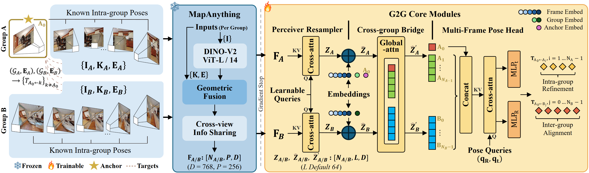

# G2G: Exploiting Intra-Group Geometry for Inter-Group Pose Estimation

<p align="center">
  
</p>

<p align="center">
  <a href="https://weiyufei0217.github.io/G2G/"></a>
  <a href="https://arxiv.org/abs/2606.08284"></a>
</p>

**[CoRL 2026 (under review)]** Official implementation of G2G.

[[中文 README]](README_CN.md)

> Recovering the relative 6-DoF pose between two image groups underlies cross-sequence relocalization, multi-camera rig odometry, and other multi-view tasks. Each group carries **known intra-group geometry** from a pre-built map, odometry, or rig calibration, and pretrained multi-view backbones already fuse such geometry into visual features. Yet current models treat all views as an unstructured set, leaving **cross-group reasoning** as the missing piece.
>
> G2G keeps a multi-view foundation model entirely frozen and adds three lightweight trainable modules (32M parameters, under 6% of the full model) to bridge the two groups: a perceiver resampler, a cross-group bridge with merged self-attention, and a multi-frame pose head. Supervised only by relative poses, G2G attains state-of-the-art accuracy on both tasks across four datasets.

## Highlights

- **Exploits intra-group geometry in a unified framework**: unlike methods that flatten all views into an unstructured set, G2G explicitly leverages the known extrinsics within each group (e.g., from a pre-built map, odometry, or rig calibration) for cross-group pose reasoning, with a single architecture handling both cross-sequence relocalization and multi-camera rig odometry.
- **Lightweight and efficient**: only 32M trainable parameters on top of a frozen MapAnything backbone (539M), supervised by relative poses alone.
- **Four datasets, 10 pretrained weights**: HM3D (indoor sim), TartanGround (outdoor sim), NCLT (real cross-season), ZJH (sim-to-real transfer).

## Installation

### 1. Create conda environment

```bash
conda create -n g2g python=3.12 -y
conda activate g2g
pip install torch torchvision --index-url https://download.pytorch.org/whl/cu121
```

### 2. Install MapAnything (backbone)

> **Important — the backbone code is vendored for you (reproducibility).** G2G is trained against
> the **DINOv2-large / 1024-dim** MapAnything backbone (released around Oct–Nov 2025). The official
> repo has since switched its default to a **DINOv2-giant / 1536-dim** backbone (`v1.1`+ and the
> current Hugging Face weights), whose tensor shapes are **incompatible** with the released G2G
> modules. To make the release self-contained, we ship the exact backbone code under
> [`third_party/mapanything/`](third_party/mapanything/): a copy of MapAnything **v1.0.1**
> (large/1024, commit `fde8425`) with **one** documented modification that exposes the
> information-sharing features G2G consumes — `forward(..., return_info_sharing_features=True)`
> (see [`third_party/mapanything/NOTICE`](third_party/mapanything/NOTICE)). Just install it locally;
> no need to clone upstream or pick a commit.

```bash
pip install -e ./third_party/mapanything
```

Download the matching backbone checkpoint (large/1024, ~2.1 GB) from our
[Baidu Cloud](https://pan.baidu.com/s/17Z3jKvIYj_miHSiaQ_8Ctg?pwd=8888) (extraction code: `8888`), [Google Drive](https://drive.google.com/drive/folders/1z6RfJT5i8n5C9YaZSwGyzv9LdbEQWcq5?usp=sharing), or [Hugging Face](https://huggingface.co/feixue22/G2G)
and place it at `map-anything-model/`. This is the exact `facebook/map-anything` **large** variant
served before the December 2025 giant update; **do not** download the current Hugging Face weights,
which are the incompatible giant model.

### 3. Install G2G

```bash
cd G2G
pip install -e .
```

### 4. Install remaining dependencies

```bash
pip install -r requirements.txt
```

## Dataset Preparation

### HM3D

G2G uses the HM3D dataset with a custom preprocessing pipeline. See [`data_preprocessing/README.md`](data_preprocessing/README.md) for the full pipeline.

The pipeline generates:
- **step1**: Trajectory sampling
- **step2**: Rig configuration (8-camera)
- **step2.5** (optional): Per-camera random intrinsics (HFOV in [45 deg, 120 deg], centered principal point)
- **step3**: RGB + uint16 depth rendering (224x224, 1mm precision)
- **step4**: Overlap matrices via depth projection
- **step5**: G2G window index with GT overlap (no external covisibility model needed)
- **step6** (optional): DINOv2 feature extraction

### Other Datasets

For TartanGround, NCLT, and ZJH datasets, follow similar preprocessing steps. Adjust the config paths accordingly.

### Config Path Setup

All configs use placeholder paths (`/path/to/...`). Before training or evaluation, replace them with your actual data paths:

```bash
# Example for HM3D-Reloc
sed -i 's|/path/to/data/HM3D|/your/actual/path/HM3D|g' configs/reloc/hm3d.yaml
sed -i 's|/path/to/map-anything-model/|/your/actual/path/map-anything-model/|g' configs/reloc/hm3d.yaml
```

## Pre-trained Models

Download all weights from [Baidu Cloud](https://pan.baidu.com/s/17Z3jKvIYj_miHSiaQ_8Ctg?pwd=8888) (extraction code: `8888`), [Google Drive](https://drive.google.com/drive/folders/1z6RfJT5i8n5C9YaZSwGyzv9LdbEQWcq5?usp=sharing), or [Hugging Face](https://huggingface.co/feixue22/G2G) and place them in `release_weights/`.

| Weight | Task | Dataset |
|--------|------|---------|
| `HM3D-Reloc.pth` | Reloc | HM3D |
| `TartanGround-Reloc.pth` | Reloc | TartanGround |
| `NCLT-Reloc.pth` | Reloc | NCLT |
| `ZJH-Reloc.pth` | Reloc | ZJH |
| `HM3D-Rig-8.pth` | Rig | HM3D (8-cam) |
| `HM3D-Rig-4.pth` | Rig | HM3D (4-cam) |
| `TartanGround-Rig-4.pth` | Rig | TartanGround (4-cam) |
| `NCLT-Rig-Intra.pth` | Rig | NCLT intra-season (5-cam) |
| `NCLT-Rig-Cross.pth` | Rig | NCLT cross-season (5-cam) |
| `ZJH-Rig-4.pth` | Rig | ZJH (4-cam) |

These are G2G-only weights (frozen backbone excluded). The evaluation scripts automatically handle partial loading.

The same [Baidu Cloud](https://pan.baidu.com/s/17Z3jKvIYj_miHSiaQ_8Ctg?pwd=8888) share (code: `8888`, also mirrored on [Google Drive](https://drive.google.com/drive/folders/1z6RfJT5i8n5C9YaZSwGyzv9LdbEQWcq5?usp=sharing) and [Hugging Face](https://huggingface.co/feixue22/G2G)) also provides:
- the **example sanity-check bundles** — extract into `examples/` (see [`examples/README.md`](examples/README.md) for the layout);
- the **raw evaluation results** (paper-subset per-pair CSVs) — extract into `eval_results/`;
- the **MapAnything backbone checkpoint** — extract into `map-anything-model/` (see Installation step 2).

These large assets are kept out of the git repository to keep it lightweight.

## Training

### Relocalization (Task 1)

```bash
torchrun --nproc_per_node=4 scripts/train_reloc.py \
    --config configs/reloc/hm3d.yaml \
    --curriculum
```

### Rig Odometry (Task 2)

```bash
torchrun --nproc_per_node=4 scripts/train_rig.py \
    --config configs/rig/hm3d_8cam.yaml
```

Add `--overfit` for quick sanity checks on a small subset.

## Evaluation

### Relocalization

```bash
python scripts/eval_reloc.py \
    --config configs/reloc/hm3d.yaml \
    --checkpoint release_weights/HM3D-Reloc.pth \
    --output-dir outputs/eval_HM3D-Reloc \
    --batch-size 16 --min-overlap 0.1
```

### Rig Odometry

```bash
python scripts/eval_rig.py \
    --config configs/rig/hm3d_8cam.yaml \
    --checkpoint release_weights/HM3D-Rig-8.pth \
    --output-dir outputs/eval_HM3D-Rig-8 \
    --batch-size 8
```

Multi-GPU evaluation:
```bash
torchrun --nproc_per_node=4 --master-port=29590 \
    scripts/eval_reloc.py \
    --config configs/reloc/hm3d.yaml \
    --checkpoint release_weights/HM3D-Reloc.pth \
    --batch-size 16 --min-overlap 0.1
```

## Weight Extraction

To extract G2G-only weights from a full training checkpoint (which includes the frozen backbone):

```bash
python scripts/extract_g2g_weights.py \
    --input /path/to/full_checkpoint.pt \
    --output release_weights/MyModel.pth
```

## Acknowledgements

- [MapAnything](https://github.com/facebookresearch/map-anything) for the multi-view foundation model backbone.
- [DINOv2](https://github.com/facebookresearch/dinov2) for the visual encoder.

## License

This project is licensed under [CC BY-NC 4.0](LICENSE).

## Citation

If you find this work useful, please cite:

```bibtex
@misc{wei2026g2gexploitingintragroupgeometry,
      title={G2G: Exploiting Intra-Group Geometry for Inter-Group Pose Estimation},
      author={Yufei Wei and Shuhao Ye and Chenxiao Hu and Yiyuan Pan and Dongyu Feng and Rong Xiong and Yue Wang and Yanmei Jiao},
      year={2026},
      eprint={2606.08284},
      archivePrefix={arXiv},
      primaryClass={cs.CV},
      url={https://arxiv.org/abs/2606.08284},
}
```
